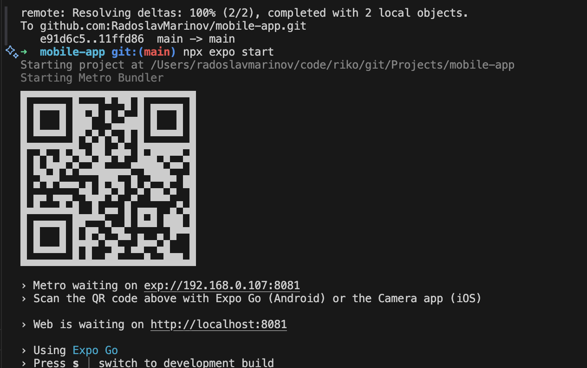

[🏠 Back to Home](../../README.md)

# Development

Once you are done with the [project setup](../ProjectSetup/index.md) you can proceed with starting development server, hook it to the *Expo Go* app and start development

### Start development server

```
npx expo start
```
Running this command in the terminal will produce QR code and link to a local development server to open the app in a browser.
  - 1. Open the **ExpoGo** app then press **Scan QR Code**. Scan the QR code from the terminal and you will be able to see the app on your mobile phone.

  - 2. Or open the link to the localhost and see your app in browser

  
