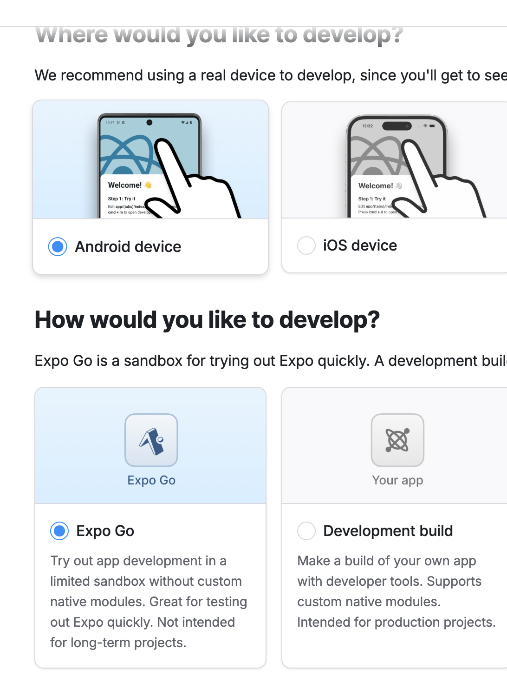
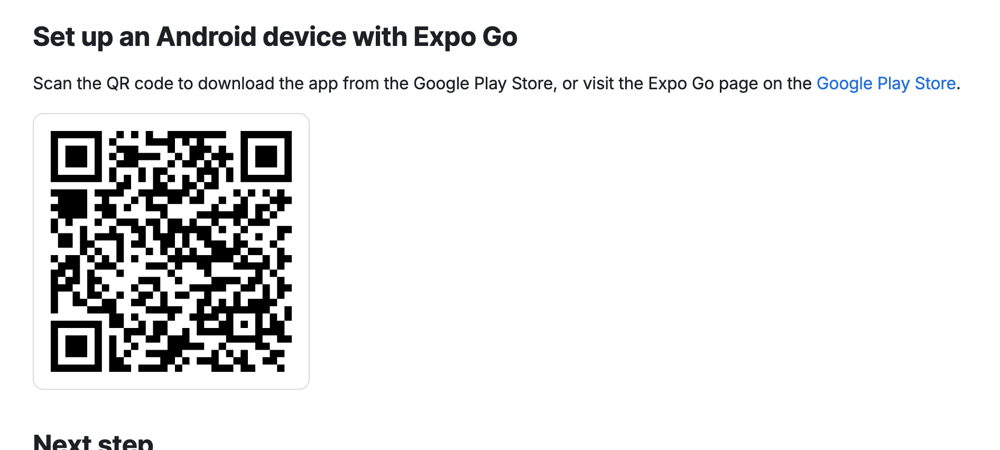

[🏠 Back to Home](../../README.md)

# Project setup

- 1. `npx create-expo-app@latest`
- 2. [Continue with ExpoGo](https://docs.expo.dev/get-started/set-up-your-environment)
    - Select Android (or IOS) device, then click on **Expo Go** 
    
    and then download the mobile **Expo Go** app
    

> _Next step_ [Development](../Development/index.md)

## Resources
  - [React native official documentation - Get started](https://reactnative.dev/docs/environment-setup#start-a-new-react-native-project-with-expo)